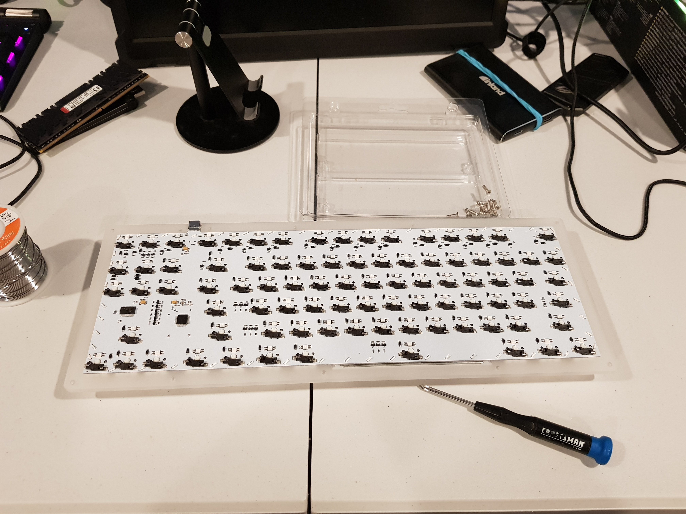

# SONiX Microcontroller Firmware Dumping

This project provides scripts to dump the firmware from SONiX SN32 series ARM microcontrollers.  Dumping is done using an ST-Link device connected to the chip's SWD interface and uses the OpenOCD software.

This script can dump firmware even if the microcontroller's code protection is enabled.  It does this by using "gadgets", known addresses in the boot ROM corresponding to LDR and STR instructions which can be used to read/write the inaccessible flash memory address space into CPU registers which can then be extracted.

To make this process easy for the end user, we've created scripts for each SONiX microcontroller we support.  All you have to do is run the script, the rest is taken care of for you.

# Connecting your Keyboard

The primary purpose of this project is to dump stock firmware for SONiX based keyboards (including EVision and HFD chips, which are rebranded SONiX SN32) before flashing SonixQMK firmware.  To get started, you need to disassemble your keyboard:

The next step is to locate the SONiX (or EVision/HFD) microcontroller chip on the PCB.  Common part numbers are:

* SN32F248
* SN32F248B
* VS11K09A (EVision)
* VS11K09A-1 (EVision)

After locating the chip, you will need to find the following pins:

* BOOT
* SWCLK
* SWDIO
* VCC
* GND

Once you determine the pinout, it's time to warm up the soldering iron and put down some breakout wires.  After the wires are broken out, you can connect them to the ST-Link.

After soldering, it's time to connect the ST Link.  You want to connect as follows (ST Link --> Keyboard):

* SWCLK --> SWCLK
* SWDIO --> SWDIO
* 3.3V --> VCC
* GND --> Both GND and BOOT

In the picture, the wires coming out of the ST Link:

* White: 3.3V
* Black: GND
* Purple: SWCLK
* Gray: SWDIO

